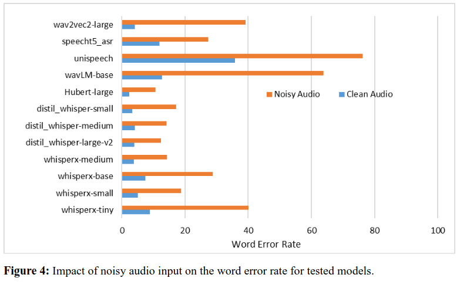
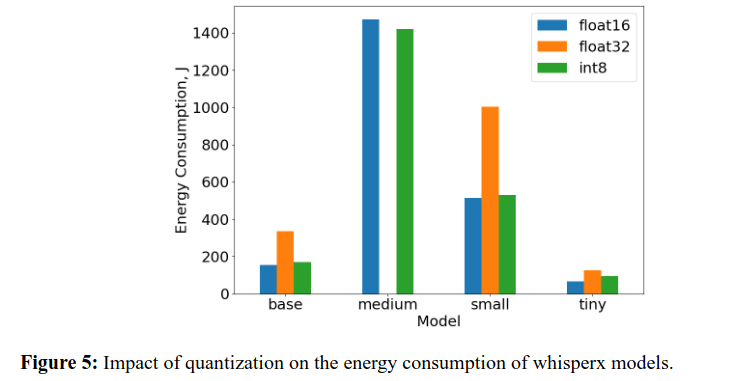
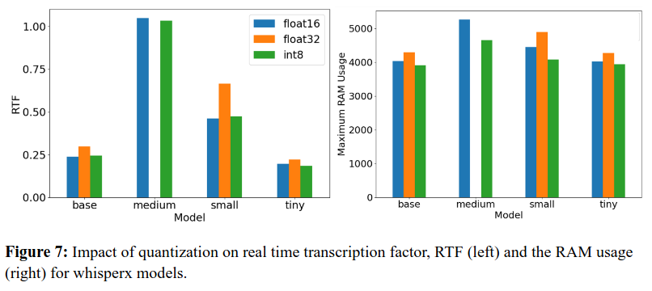
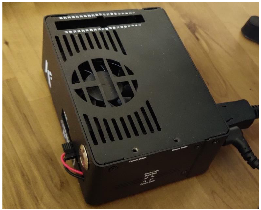
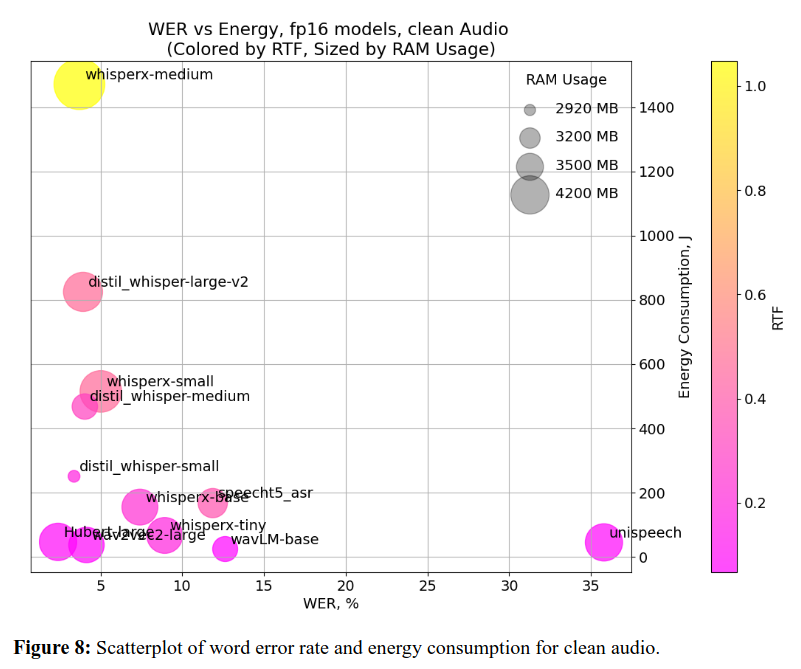

This is the repository to reproduce the results in the Arxiv article 
https://arxiv.org/abs/2405.01004
**Deep Learning Models in Speech Recognition: Measuring GPU Energy Consumption, Impact of Noise and Model Quantization for Edge Deployment**
This timely article explores the performance of automatic speech recognition models' performance when deployed on an edge GPU (Jetson orin nano) 
when there is noise in the audio, and impact of quantization (fp32, fp16, in8) on energy consumption, transcription speeds, and RAM usage. 






Experiments are done on a Jetson Orin Nano 8 GB developer kit running JetPack 5.1.2. (LT35.4.1) 





**Steps to run speech transcription using the whisperx models on your own jetson device**: 

NOTE: whisperx family of models were run using the whisperx docker-container from https://github.com/dusty-nv/jetson-containers
remaining models were run natively on the jetson using command line interface. 

1. Change the MODEL_NAME="base" to your choice. Currently, options are base, tiny, small and medium. You need to give additional keywords
for specifying the quantization type. Follow the syntax given in https://github.com/m-bain/whisperX for more details.
   
2. A.Modify the ts.sh file as follows (ts.sh is the bash script which runs the docker container for running whisperx models)
In the ts.sh file adjust the input and output directory containing audio files and the predicted text files  
The line is "FULL_OUTPUT=$(jetson-containers run -d -v /home/chakz/Desktop/dev-clean-2/3752/4944:/app/audio -v /home/chakz/Desktop/outputs:/app/outputs $IMAGE_TAG)"

B. Appropriately change the reference and predicted text paths in the ```Wer_calculation_from_output.py```(for WER calculation) and appropriately change the baseline power, GPU utilization and memory values in the ```process_power_report_jp51.py```(post procesing to get final energy consumption). 

Once the input and output paths are correctly configured,  go
```
chmod +x ts.sh
```
to add permissions, this needs to be done just once. Thats it. Now simply type 
```
./ts.sh
```
Note that the chmod process needs to be done just once.

The completed run will produce a output csv file which will then be parsed by another Python script to finally calculate the energy consumption and other stats. 

3. Final results would be appended in a txt file 'process log'. Each runs details are appended in the process log.

4. Alternatively, you could use
```run_experiments.sh ```
which would run all the 4 models for all three quantization types. To do that, specify the audio input directory
   in the run_single_experiment.sh script.

**Steps to run speech transcription using HF models directly your own jetson device (i.e., no jetson-container)**:

This ones a lot easier, simply use the python scripts (e.g., ```hf_asr_hubert.py```, or ```hf_asr_wavLM.py```, etc.). You just need to adjust the audio input directory in the python script. You can change the model and process kwargs in the script to adapt this to any suitable HF model of your choice.  
